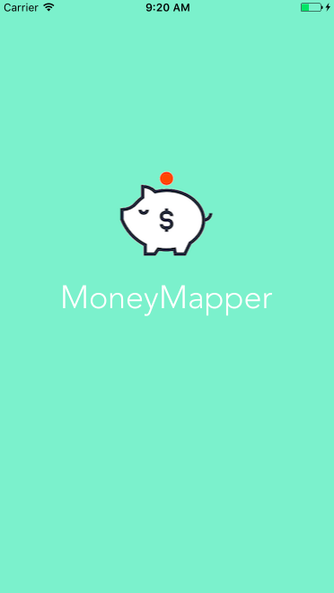
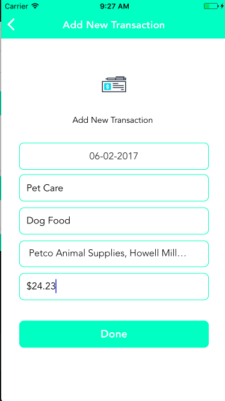
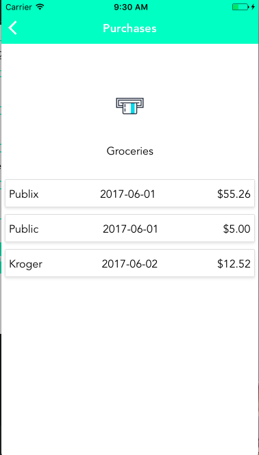
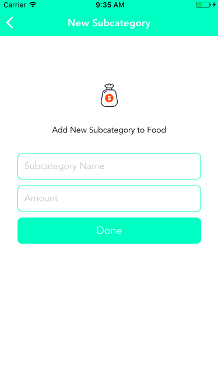
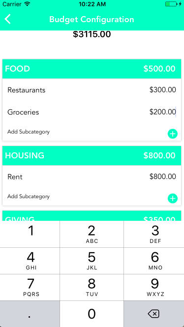
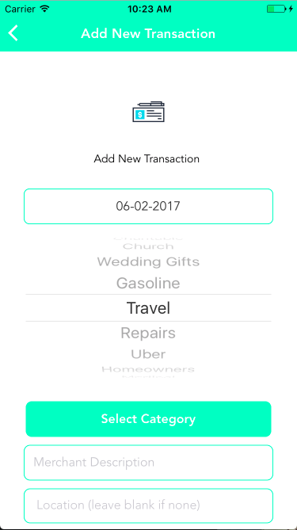

# MoneyMapper
---
## [Demo Video](https://www.youtube.com/watch?v=0Ci2ssx67Fg)

## What It Is
MoneyMapper is a personal finance management mobile app. It allows users to create and manage their budget and visually see where their money is going every month.

## Team Members
* Julie Dyer
* Todd Briley

## What we used
* React Native
* React
* Redux
* PostgreSQL
* Express
* Xcode
* Google Places (for autocomplete when searching)
* Google Maps (for showing transactions on a map)
* React Native Router Flux (for app routing)

## App Walkthrough

### Launch Screen
Launch screen when app is clicked on an iPhone.
<p align='center'>
    </img>
</p>

### Home Screen
Home screen users see when app launches. Existing users can log in and new users can create an account.
<p align='center'>
    </img>
</p>

### User Home
User's home screen once they have successfully logged in. At the top left user's can click the plus button to add a new transaction. The settings button on the top right can be clicked to configure the budget.
<br>
The budget totals are displayed at the top along with a link to the map view.
<br>
Under the budget totals is a breakdown of main category and subcategory expenses. Any subcategory can be clicked to show the transactions for that subcategory.

<p align='center'>
    </img>
</p>

### Add transaction
Users can select the date of the transaction, write a description of the purchase, select subcategory, enter an amount, and live search for a location if applicable. Clicking done takes the user back to their Expense summary home page.
<p align='center'>
    </img>
</p>

### Transactions
When a subcategory is clicked a user is taken to this page where they can view a summary of purchases for that particular subcategory.
<p align='center'>
    </img>
</p>

### Map view
In map view users can visually see where their money is going. Markers can be tapped to view more details about a particular transaction.
<p align='center'>
    </img>
</p>

### Budget Configuration
On the budget configuration page users can update amounts for existing categories and add new categories as they see fit. Totals automatically update as the user is typing.
<p align='center'>
    </img>
</p>

### Add New subcategory
If the Add subcategory button is clicked on the budget configuration page the user is taken to this page where they can add a new subcategory under the Main category that was clicked. Clicking done takes the user back to the configuration page.
<p align='center'>
    </img>
</p>

## Challenges

### Learning React Native
For our final project at DigitalCrafts we decided we wanted to learn something new and challenge ourselves. In class we had been working with React/Redux and had built a couple applications with it and were feeling fairly comfortable with it. We thought a good next step to try would be React Native.
<br>
<br>
Learning React Native ended up being a huge challenge for us. Initially we thought we could just dive in and start making the app but we quickly learned there were too many differences that we weren't understanding. There's a big jump between the browser environment and the iOS environment.
<br>
<br>
We decided to step back from the project for a couple days to learn the fundamentals of React Native. We used Stephen Grider's 16 hour React Native Udemy course and at the end felt so much more confident about our skills.
<br>
<br>
Another part of the challenge was that our instructor has not worked with React Native so he wasn't able to help us to the same depth that we had become accustomed to. React Native is also a very new technology, so we had issues with finding examples and good documentation.

### Layout & Positioning
These concepts are very different in the mobile environment. Typical CSS styling applies in some cases for things like colors and fonts but layout and positioning is very different. React Native uses a very different nomenclature and object model which took some time getting used to.

### React Native Navigation
By navigation we mean going from page to page, and back, switching between pages etc. There are a lot of options out there for how to do navigation with React Native. We tried several of them and ended up going with react-native-router-flux because it was the most popular one and also the one Stephen Grider used in the Udemy tutorial.
<br>
<br>
It took us a lot of trial and error but once we got it working it was fairly easy to build on. We thought everything was working smoothly but we noticed that when we'd be using the app for a while and navigating around the app would crash due to some problem with the navigation stack. To fix it we did some more research and testing to get a better understanding of what was going on. The final solution was to clear the navigation stack at the point of navigating to a new page to keep the stack clean.

```JavaScript
const RouterComponent = () => {
    return (
        <Router navigationBarStyle={styles.navBar} titleStyle={styles.navTitle} sceneStyle={styles.routerScene} barButtonIconStyle={{ tintColor: 'white' }}>

            <Scene key="root">

                <Scene key="auth">
                    <Scene key="login" component={Login} title="Money Mapper" />
                    <Scene key="signup" component={CreateAccount} title="Sign Up" />
                </Scene>

                <Scene key="main">
                    <Scene key="home"
                        component={Home}
                        title="Spending Summary"
                        leftButtonImage={require("./components/Resources/add.png")} onLeft={()=>{Actions.addNewTransaction()}}
                        rightButtonImage={require("./components/Resources/settings2.png")} onRight={()=>{Actions.budgetConfig()}}
                    />
                    <Scene key="budgetConfig" component={Settings} title="Budget Configuration" />
                    <Scene key="map" component={Map} title="Map View" />
                    <Scene key="addNewSubcategory" component={AddNewSubcategory} title="New Subcategory" />
                    <Scene key="viewSubcategoryTransactions" component={SubcategoryTransactions} title="Purchases" />
                    <Scene key="addNewTransaction" title="Add New Transaction" component={AddNewTransaction} />
                </Scene>

            </Scene>

        </Router>
    );
};
```

### Spending Summary page
Showing all the expenses for each user meant we needed the user to be able to scroll though all the categories. Scrolling is not a automatic capability like it is in the browser, it has to be explicitly coded using either the ListView or ScrollView. The process for getting a ListView working is not the most intuitive and is very different than a typical HTML table or ul / li list. And of course, it's not well documented! With the help of Stephen's video we were were able to get this working the way we wanted.

```JavaScript
const ds = new ListView.DataSource({
    rowHasChanged: (r1, r2) => r1 !== r2
});
this.dataSource = ds.cloneWithRows(this.props.expenses);
const totalMonthlyBudget = this.props.expenses.reduce((accum, category) =>{
  return accum + category[Object.keys(category)[0]].subcategories.reduce((accum, subcategory) => {
    return accum + Number(subcategory[Object.keys(subcategory)[0]].monthlyBudget);
  },0);
},0);

let totalSpent = this.props.expenses.reduce((accum, category) =>{
  return accum + Number(category[Object.keys(category)[0]].spent);
},0);
totalSpent = totalSpent.toFixed(2);
const remaining = (totalMonthlyBudget - totalSpent).toFixed(2);

return (
    <View>
        <ListView
            dataSource={this.dataSource}

            renderRow={this.renderRow.bind(this)}

            renderHeader={()=> (
                <View style={styles.intro}>
                    <Text style={styles.statusText}>Hello {this.props.user.firstName}!</Text>
                    <Image source={require('./Resources/piggy-bank.png')} style={styles.icon} />

                    <CardSection>
                        <View style={styles.totals}>
                            <Text style={styles.totalsText}>Your Budget</Text>
                            <Text style={styles.amountText}>${totalMonthlyBudget.toFixed(2)}</Text>
                        </View>
                    </CardSection>

                    <CardSection>
                        <View style={styles.totals}>
                            <Text style={styles.totalsText}>Spent</Text>
                            <Text style={styles.amountText}>{'$' + totalSpent}</Text>
                        </View>
                    </CardSection>

                    <CardSection>
                        <View style={styles.totals}>
                            <Text style={styles.totalsText}>Remaining</Text>
                            <Text style={styles.amountText}>{'$' + remaining}</Text>
                        </View>
                    </CardSection>

                    <CardSection>
                        <TouchableOpacity style={styles.totals} onPress={()=> this.mapClick()}>
                            <View style={styles.totals}>
                                <Text style={styles.totalsText}>Map View</Text>
                                <Image source={require('./Resources/map.png')} style={styles.map} />
                            </View>
                        </TouchableOpacity>
                    </CardSection>

                    <View style={styles.separator}></View>

                </View>
            )}

            renderFooter={()=> (
                <View>
                    <View style={styles.separator}></View>
                    <Button onPress={()=> this.logoutClick()}>Logout</Button>
                    <View style={styles.separator}></View>
                </View>
            )}
         />

    </View>
```

### Keyboard
The keyboard is another issue we had  that we didn't realize until we started testing on an actual phone. At any point of user input the keyboard would pop up and hide the rest of the page. What you're used to seeing on a mobile app of being able to scroll to see what the keyboard is hiding is not an automatic behavior. And naturally, the solution was not an easy or straightforward one.
<br>
<br>
We had to use event handlers that would listen for the keyboard opening event. On that event the page content would be adjusted and basically moved out of the way of the keyboard. And moved back when the keyboard is hidden.
<p align='center'>
    </img>
</p>

```JavaScript
componentDidMount() {
  _keyboardWillShowSubscription = DeviceEventEmitter.addListener('keyboardWillShow', (e) => this._keyboardWillShow(e));
  _keyboardWillHideSubscription = DeviceEventEmitter.addListener('keyboardWillHide', (e) => this._keyboardWillHide(e));
}

componentWillUnmount() {
  _keyboardWillShowSubscription.remove();
  _keyboardWillHideSubscription.remove();
}

_keyboardWillShow(e) {
  this.setState({ keyboardOffset: e.endCoordinates.height });
}

_keyboardWillHide(e) {
  this.setState({ keyboardOffset: 0, message: '', buttonDisabled: false });
}
```

### Selects with React Native
Another thing that is super easy with the browser that isn't with React Native is using a select box. You can't use a typical drop down so we went with a scroll Picker which is a React Native component.
<p align='center'>
    </img>
</p>
```JavaScript
hidePicker() {
       let firstCategory = Object.keys(this.props.expenses.expenses[0])[0];
       let firstSubcategory =  Object.keys(this.props.expenses.expenses[0][firstCategory].subcategories[0])[0];
       let subcategory_id = this.props.expenses.expenses[0][firstCategory].subcategories[0][firstSubcategory].id;

       if (this.state.subcategory === '') {
           this.setState({
               subcategory: firstSubcategory,
               subcategory_id: subcategory_id,
           })
       }
       this.setState({
           showPicker: false,
           subcategorySelected: true,
       });
   }

buildPickerList(){
    let itemList = this.props.expenses.expenses.map(category => {
        let categoryName = Object.keys(category)[0];
        let arrSubcategories = category[categoryName].subcategories;
        return arrSubcategories.map(objSubcategory => {
            let subcategoryName = Object.keys(objSubcategory)[0];
            let subcategoryId = objSubcategory[subcategoryName].id;
                return (<Item label={subcategoryName} value={subcategoryName +'::' + subcategoryId} />);
            })
        })
    return itemList;
}
```

### Google Places Autocomplete search
Part of what makes the app cool is that you can see on a map where your purchases come from. But no one actually knows the address of their local sandwich shop, they just know the name of it. So we wanted to use Google Places to aid in the searching of a location. Google Places and the phone's geolocation are used hand in hand so that when a user is live searching a location the one closest to them will pop up first. When the user selects that location and adds a new transaction the coordinates of that location are added to the database and can then be viewed on the map.
<br>
<br>
We had to do a lot of styling to get this module to fit with the style of our app. It does come with pretty good documentation and some styling options but I ended up having to go into the style source code to actually modify it fully.
<p align='center'>
    </img>
</p>
</p>
```JavaScript
<GooglePlacesAutocomplete
  placeholder='Location (leave blank if none)'
  minLength={2}
  autoFocus={false}
  listViewDisplayed='auto'
  fetchDetails={true}
  renderDescription={(row) => row.description}
  enablePoweredByContainer={false}
  onPress={(data, details = null) => {
      let location = details.formatted_address;
      this.selectedLocation(location);
  }}
  getDefaultValue={() => {
    return '';
  }}
  query={{
    key: config.googlePlacesKey,
    language: 'en',
  }}
  styles={{
    description: {
        fontFamily: 'Avenir',
        fontWeight: '300',
    },
    textInput: {
        fontFamily: 'Avenir',
        fontWeight: '300',
        paddingBottom: 5,
    },
  }}
  GooglePlacesSearchQuery={{
    rankby: 'distance',
  }}
  filterReverseGeocodingByTypes={['locality', 'administrative_area_level_3']}
  debounce={200}
/>
```

### Xcode
Going into this we had absolutely no training or experience with Xcode or the Simulator. And also Stephen Grider's course did not cover using Xcode either so we just didn't have a lot of information. We found it very difficult to navigate and figure out how to get things to work. One big issue that took some time was getting the Launch Image to display properly. There were clearly a few different ways to do it and none of them seemed to work perfectly on the Simulator and also on iPhones of different sizes.
<br>
<br>
Take away - we still don't know Xcode. We figured out enough to get by but we definitely would need some serious training to really figure out all that it does and how to use it.
